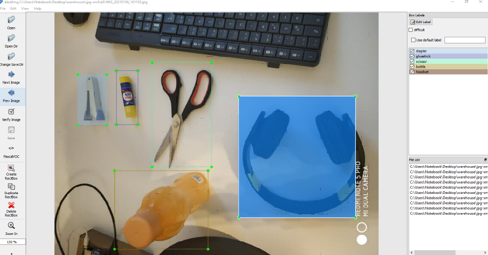
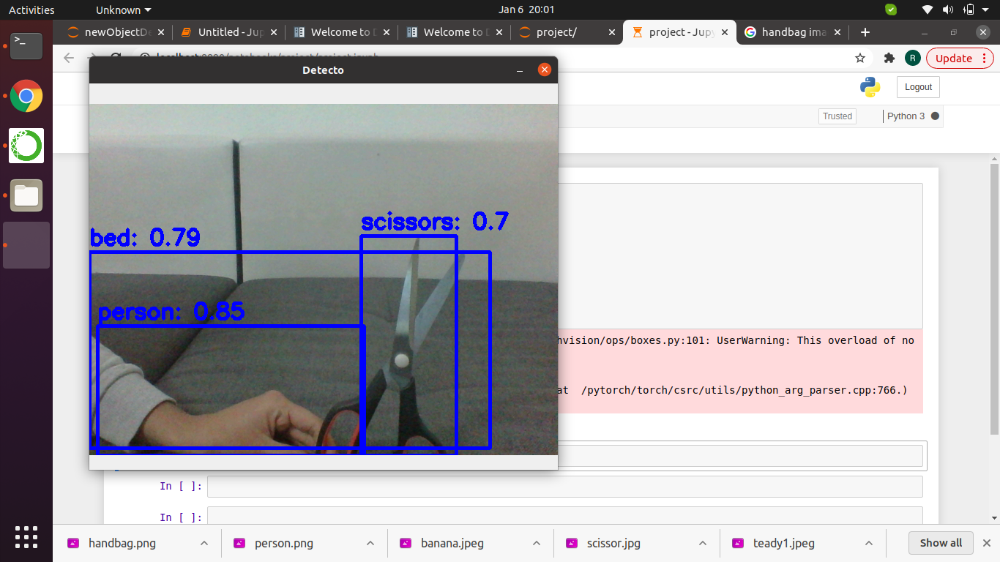
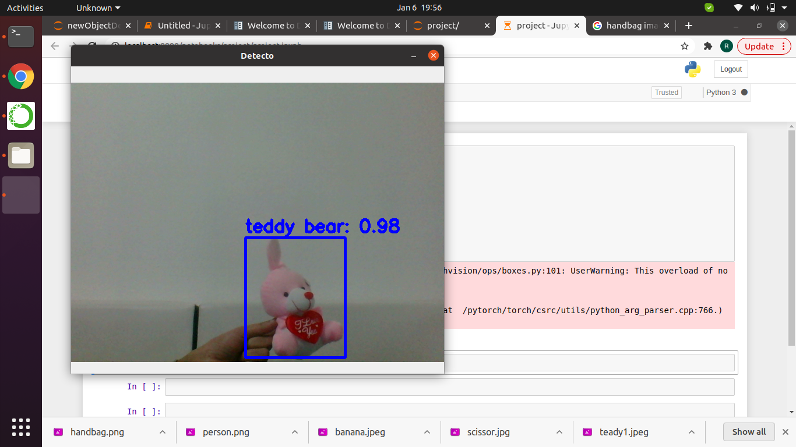

# Transfer-Learning-for-Object-Detection-with-Deep-Convolutional-Networks

Object detection is a key topic in image processing and computer vision. Various algorithms
are developed for this purpose. Recently, deep learning algorithms gave promising results
compared to traditional methodologies. Warehouse Automation is primary focus for many
eCommerce giants such as Amazon, eBay. High labour costs, inaccurate inventory, redundant
processes are major problems faced in warehouses. So, this paper is driven by a particular use
case where customers send back ordered items, and the retailer wants to automatically unpack
the returned box and sort the returned items. For this use case, evaluation is done whether this
could be achieved by Deep Convolutional Neural Networks and whether transfer learning
allows to adopt to new items. An overview on object detection with deep convolutional neural
networks (DCNNs) and an overview on transfer learning are also provided in this survey.
Added to this, implementation results of existing object detection model are shown. Finally, the
implementation results of own customized object detection model inside the box are depicted. 

##  Project Documents
- [Project Slides (PDF)](docs/Transfer-Learning-for-object-detection-Project-Presentation.pdf)
- [Presentation Report (PDF)](docs/Transfer-Learning-for-object-detection-Project-Report.pdf)

## Experimental Results

  > 
  Experiment 1: Object Detection on Dataset A

   
  Experiment 2: Transfer Learning with Pretrained Model

   
  Experiment 3: Fine-tuning with Augmented Data

